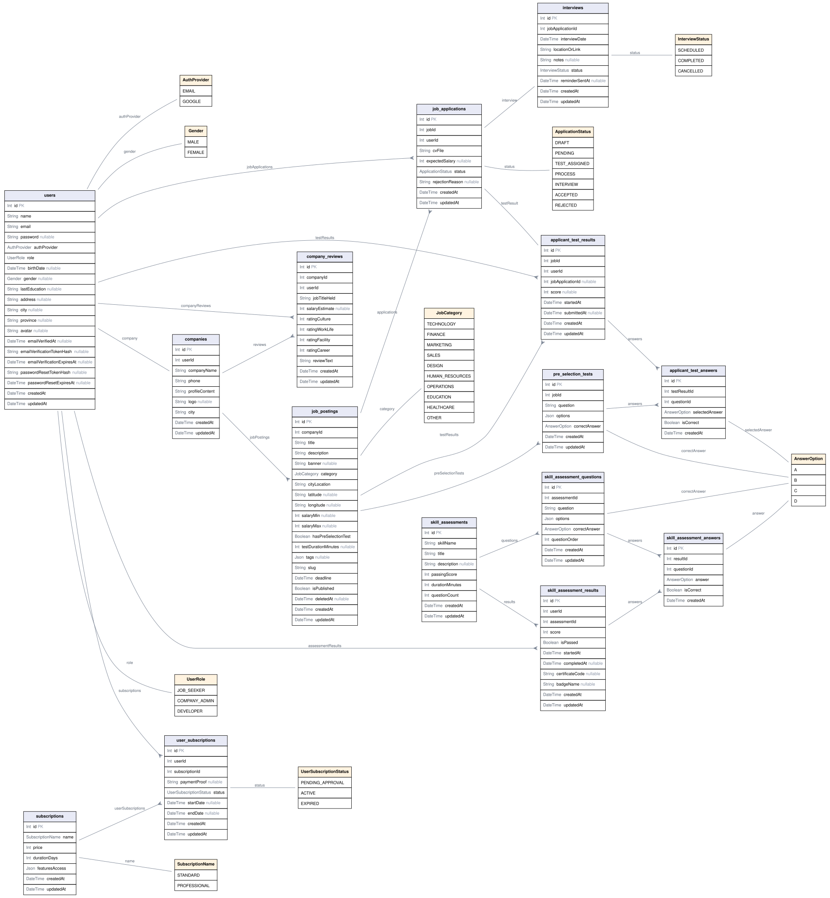

# Polaris API

Polaris is a location-aware job board that connects job seekers with thoughtful companies. It supports job discovery, applications, pre-selection tests, interviews, subscriptions, company reviews, and skill assessments in one platform.

## Technology

- Node.js, Express, and TypeScript
- PostgreSQL with Prisma ORM
- JWT, Node.js `scrypt`, and Zod validation
- Resend API for transactional email delivery
- Vitest and Supertest for integration tests

## Getting Started

```bash
cp .env.example .env
npm install
npx prisma migrate dev
npx prisma generate
npm run dev
```

The API runs on `http://localhost:8000` by default.

## Environment Variables

| Variable | Purpose |
| --- | --- |
| `DATABASE_URL` | PostgreSQL connection string. |
| `JWT_SECRET` | Secret used to sign and verify access tokens. |
| `FRONTEND_URL` | Allowed CORS origin and email-link destination. |
| `EMAIL_FROM` | Verified sender address for Resend. |
| `RESEND_API_KEY` | Resend API key for verification and password-reset emails. |
| `INTERVIEW_TIMEZONE` | Time zone used to render interview times in email and to run the reminder cron. Defaults to `Asia/Jakarta`. |

Interview reminders are sent by a cron job that runs every day at 08:00 in
`INTERVIEW_TIMEZONE` and emails every scheduled interview taking place on the
following calendar day (H-1).

When Resend is not configured outside production, Polaris logs a local email preview instead of sending an email.

## Main Capabilities

- Email/password registration for job seekers and company administrators.
- One-time email verification and password-reset links with a one-hour expiry.
- Protected profile management, password changes, and JPG/PNG avatar uploads up to 1 MB.
- Published job discovery sorted by newest entries or by proximity within a 50 km radius.
- Job applications, pre-selection testing, interview scheduling, subscriptions, reviews, and developer-managed skill assessments.

## API Overview

| Method | Endpoint | Description |
| --- | --- | --- |
| `POST` | `/auth/register` | Creates a job seeker or company admin account. |
| `POST` | `/auth/login` | Starts an authenticated JWT session. |
| `GET` | `/auth/me` | Returns the active user profile. |
| `GET` | `/auth/dashboard-overview` | Returns live dashboard counters for the active user. |
| `PATCH` | `/auth/profile` | Updates personal or company profile data. |
| `PUT` | `/auth/avatar` | Uploads a JPEG or PNG avatar up to 1 MB. |
| `GET` | `/jobs?limit=5` | Returns the newest published jobs. |
| `GET` | `/jobs?latitude=-6.2&longitude=106.8` | Returns nearby published jobs in a 50 km radius. |
| `GET` | `/jobs?city=Jakarta` | Returns published jobs for a manually selected city. |
| `POST` | `/reviews/:companyId` | Creates a company review. |
| `GET` | `/assessment/discovery` | Lists available skill assessments. |
| `POST` | `/job-posting/:slug/interviews` | Schedules interviews for one or more applicants. |
| `GET` | `/job-posting/:slug/interviews` | Lists interview schedules for a job posting. |
| `GET` | `/job-posting/:slug/interviews/:interviewId` | Returns a single interview schedule. |
| `PATCH` | `/job-posting/:slug/interviews/:interviewId` | Reschedules, annotates, or changes interview status. |
| `DELETE` | `/job-posting/:slug/interviews/:interviewId` | Removes an interview schedule. |

Protected endpoints require:

```http
Authorization: Bearer <access-token>
```

## Interview Scheduling

Interview endpoints live under a job posting and are restricted to the company
administrator who owns it.

```http
POST /job-posting/:slug/interviews
Content-Type: application/json

{
  "schedules": [
    {
      "applicationId": 12,
      "interviewDate": "2026-09-10T02:30:00.000Z",
      "locationOrLink": "https://meet.google.com/abc-defg-hij",
      "notes": "Technical round"
    },
    {
      "applicationId": 18,
      "interviewDate": "2026-09-10T04:00:00.000Z",
      "locationOrLink": "Polaris HQ, 4th floor"
    }
  ]
}
```

1. Up to 20 applicants can be scheduled in one request, and every applicant must
   receive a distinct date and time. Slots already taken on the same job posting
   are rejected with `409`.
2. Applicants on `DRAFT` or `REJECTED` status cannot be interviewed, and an
   applicant can only hold one interview at a time.
3. Scheduled applicants move to `INTERVIEW` status and are emailed their
   schedule. Rescheduling emails the new details and clears the sent reminder so
   a fresh one goes out; cancelling and deleting email the applicant as well.
4. A background job emails both the applicant and the company administrator at
   least H-1 before the interview. `reminderSentAt` keeps each reminder to one
   delivery, and a failed send is retried on the next run.

## Authentication Notes

1. Zod validates input before database operations.
2. Passwords are stored as salted `scrypt` hashes, never plaintext.
3. Verification and reset tokens are random values whose SHA-256 hashes are stored with expiration times.
4. A consumed token is cleared immediately, making every link one-time use.
5. JWTs only contain identity and role claims; fresh profile data is always read from PostgreSQL.

## Database ERD

The diagram below is generated from [`prisma/schema.prisma`](./prisma/schema.prisma). After changing a Prisma model, run:

```bash
npm run docs:erd
```

<!-- ERD:START -->

<!-- ERD:END -->

## Testing

```bash
npm run test
npm run test:run
```

Tests load `.env.test` and use `DATABASE_URL_TEST`. Never point test variables at a development or production database.
